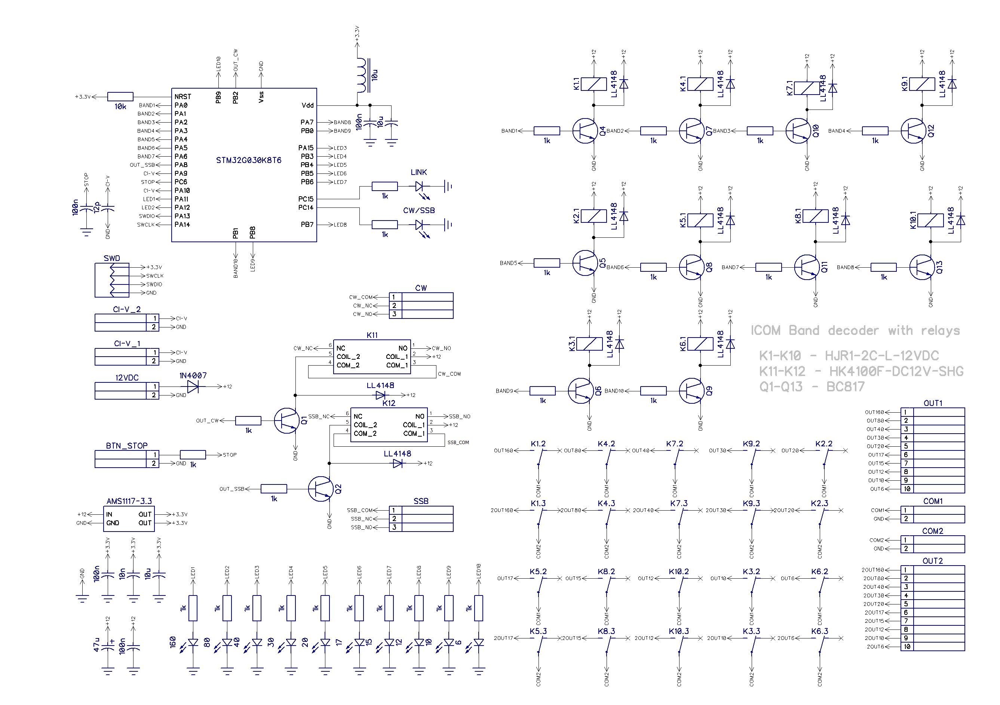
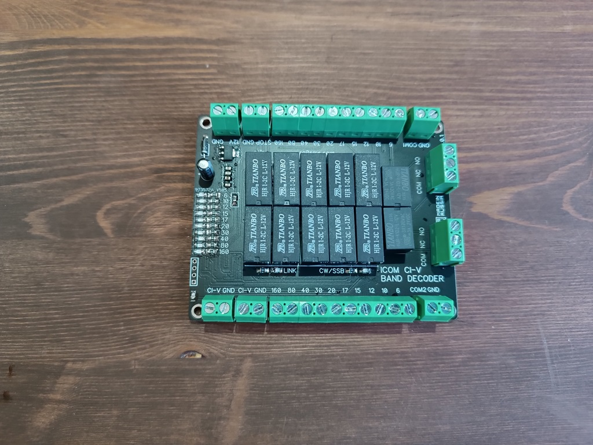
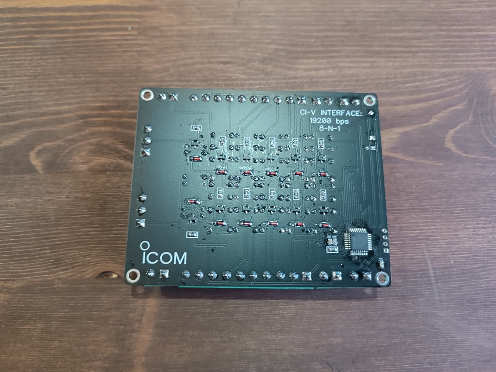

# ICOM CI-V BandDecoder

Full description - https://ra0sms.com/icom-civ-bandecoder/

The device allows you to switch external switches depending on the band selected in the transceiver. The unit also has separate relay outputs that are activated when CW or PHONE modulation is selected. The STOP button stops any switching, it must be latching.

## Technical specifications

**Power supply**: 12-15VDC

**Consumption current**: ~50mA (12VDC)

**Dimension**: 100*80mm

**Baud rate**: 19200 kb/s

**Switched external voltage**: GND, Positive or negative voltage

**Switched max current**: 500mA

**Outputs**: 2 relay outputs, relay output for CW and PHONE mode (USB, LSB, FM, AM)

**COM1 and COM2**: inputs for external voltage source

**CI-V**: input and output for CAT system to/from Icom. They are the same.

| Output | Frequency range, kHz |
| ------ | -------------------- |
| 160    | 1000 - 2999          |
| 80     | 3000 - 4999          |
| 40     | 7000 - 7999          |
| 30     | 10000 - 10999        |
| 20     | 14000 - 14999        |
| 17     | 18000 - 18999        |
| 15     | 21000 - 21999        |
| 12     | 24000 - 24999        |
| 10     | 28000 - 29999        |
| 6      | 50000 - 50999        |

