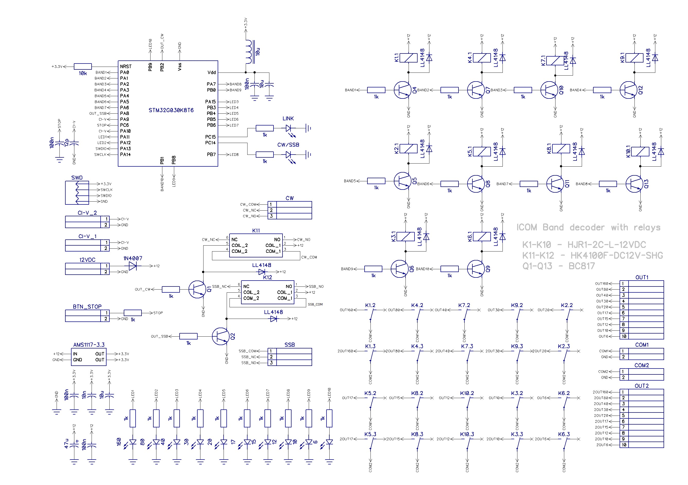
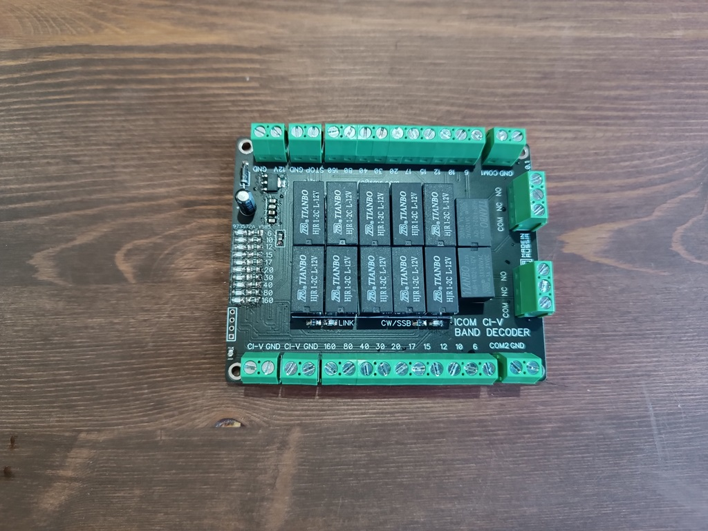
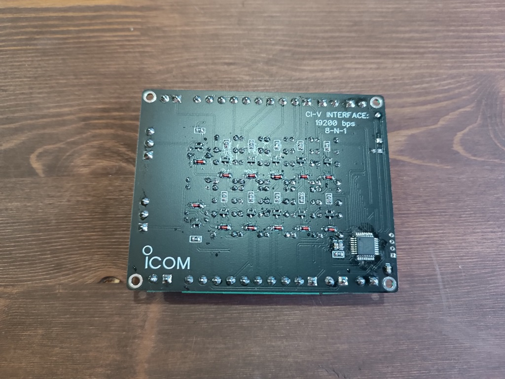
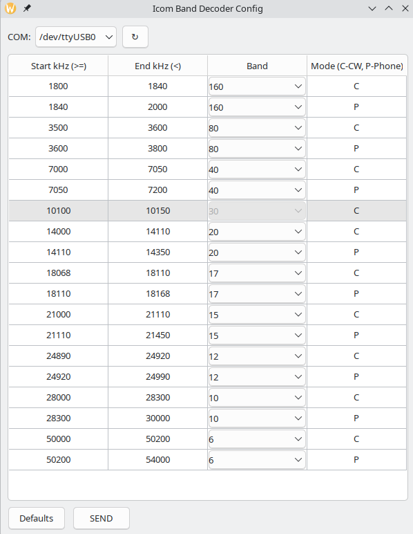

# ICOM CI-V BandDecoder

Full description - https://ra0sms.com/icom-civ-bandecoder/

The device allows you to switch external switches depending on the band selected in the transceiver. The unit also has separate relay outputs that are activated when CW or PHONE modulation is selected. The STOP button stops any switching, it must be latching.

## Technical specifications

**Power supply**: 12-15VDC

**Consumption current**: ~50mA (12VDC)

**Dimension**: 100*80mm

**Baud rate**: 19200 kb/s

**Switched external voltage**: GND, Positive or negative voltage

**Switched max current**: 500mA

**Outputs**: 2 relay outputs, relay output for CW and PHONE mode (USB, LSB, FM, AM)

**COM1 and COM2**: inputs for external voltage source

**CI-V**: input and output for CAT system to/from Icom. They are the same.

| Output | Frequency range, kHz |
| ------ | -------------------- |
| 160    | 1000 - 2999          |
| 80     | 3000 - 4999          |
| 40     | 7000 - 7999          |
| 30     | 10000 - 10999        |
| 20     | 14000 - 14999        |
| 17     | 18000 - 18999        |
| 15     | 21000 - 21999        |
| 12     | 24000 - 24999        |
| 10     | 28000 - 29999        |
| 6      | 50000 - 50999        |

## GUI for correction a band plan

Now available a new firmware for changing band plan. The new firmware you can download here:

[Firmware for 9600 kb/s](code/Debug/Icom_BD_9600_gui_latest.hex)

[Firmware for 19200 kb/s](code/Debug/Icom_BD_19200_gui_latest.hex)

[GUI software for Windows](gui/gui/zip)

To connect to the board, use the standard ICOM transceiver CAT interface connected to the CI-V connector on the decoder board.

You can adjust all bands for the corresponding output (band). You can even reassign band outputs to other bands. For example, instead of the 40m band, you can set the frequencies of the 60m band (or any other band). In this case, when you switch to the 60m band, the 40m output will automatically turn on.

After adjusting the table, press the Send button. If the settings were successfully written, the decoder board's "CW/SSB" LED will blink twice.

